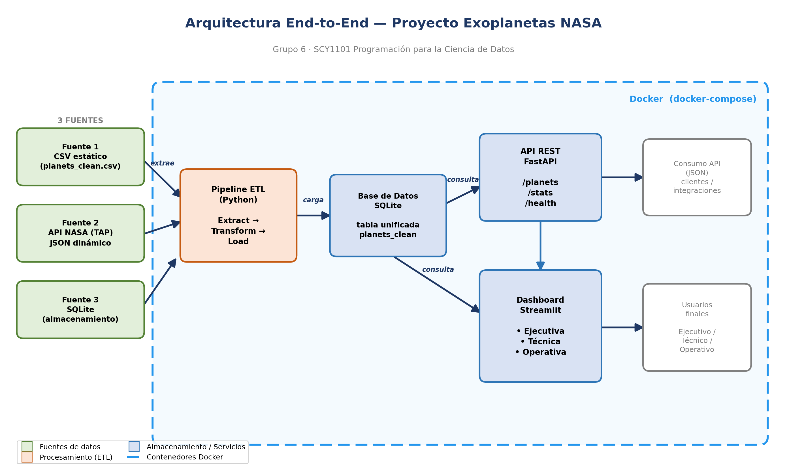

# Análisis de Exoplanetas — Solución end-to-end

Proyecto de la Evaluación Parcial N°3 de **SCY1101 Programación para la Ciencia de Datos**.

**Grupo 6:** Moira Bittner y Nicolás Carrasco.

## 1. Descripción del proyecto

Esta solución toma datos de exoplanetas, los procesa con un pipeline ETL automatizado y
los deja disponibles a través de una API y un dashboard interactivo. Todo el sistema se
levanta con Docker.

La pregunta que seguimos trabajando desde las evaluaciones anteriores es la clasificación
de los planetas según sus características físicas. Por eso el dato central que mostramos es
el **tipo de planeta** (`planet_type`): Rocoso, Neptuniano o Gigante Gaseoso.

El proyecto integra **tres fuentes de datos distintas**, como pide la evaluación:

1. **CSV** — `planets_clean.csv`, el dataset que limpiamos en las Evaluaciones 1 y 2.
2. **API REST de la NASA** — el servicio TAP del NASA Exoplanet Archive, para traer datos
   de exoplanetas confirmados.
3. **Base de datos SQLite** — donde el ETL consolida ambas fuentes y desde donde leen la
   API y el dashboard.

## 2. Arquitectura



El flujo de extremo a extremo es:

**CSV + API de la NASA -> ETL -> base SQLite -> API (FastAPI) y Dashboard (Streamlit)**,
todo orquestado con **Docker Compose**.

- El **ETL** extrae el CSV y consulta la API de la NASA, unifica ambas fuentes al mismo
  esquema, calcula la columna `planet_type` y carga el resultado en SQLite.
- La **API** lee esa base y expone los datos en endpoints REST.
- El **dashboard** consume la API y muestra la información en tres vistas según la audiencia.
- El **volumen compartido de Docker** (`db-data`) permite que el ETL escriba la base y que
  la API la lea, aunque corran en contenedores distintos.

## 3. Estructura de carpetas

```
Evaluacion3_Exoplanetas/
├── api/            API REST con FastAPI (Moira)
├── dashboards/     Dashboard con Streamlit (Moira)
├── etl/            Pipeline ETL y su Dockerfile (Nicolás)
├── docker/         Dockerfiles de API y dashboard + docker-compose.yml
├── scripts/        crear_bd.py: base de prueba desde el CSV
├── tests/          Pruebas automatizadas de la API
├── docs/           Documentación y diagramas
└── data/           CSV de origen y base exoplanets.db generada
```

## 4. Requisitos

- Docker y Docker Compose (forma recomendada de correr el proyecto).
- Alternativa sin Docker: Python 3.11 o superior y las librerías de cada `requirements.txt`.

## 5. La base de datos

El ETL crea una tabla llamada **`planets`** en SQLite. Es el "contrato" entre el ETL y la
API/dashboard: todos usan estos mismos nombres de columna.

| Columna | Descripción |
|---|---|
| nombre | Nombre del planeta |
| estrella | Estrella anfitriona |
| metodo_descubrimiento | Cómo se descubrió |
| mision | Misión de descubrimiento |
| planetas_en_sistema | Cuántos planetas tiene el sistema |
| periodo_orbital_dias | Período orbital (días) |
| semieje_mayor_au | Semieje mayor (UA) |
| excentricidad | Excentricidad de la órbita |
| masa_jup | Masa (en masas de Júpiter) |
| radio_jup | Radio (en radios de Júpiter) |
| densidad | Densidad |
| distancia_pc | Distancia (parsecs) |
| temp_estrella_k | Temperatura de la estrella (K) |
| masa_estrella | Masa de la estrella |
| radio_estrella | Radio de la estrella |
| planet_type | Clasificación: Rocoso / Neptuniano / Gigante Gaseoso |

**Clasificación (`planet_type`):** la API de la NASA no entrega este dato, así que se
calcula en el ETL según el radio del planeta (en radios de Júpiter): menor a 0.16 es
**Rocoso**, menor a 0.28 es **Neptuniano** y el resto **Gigante Gaseoso**. Los umbrales se
ajustaron a la escala del dataset, cuyo radio está acotado (máximo aprox. 0.42 R_Júpiter).

## 6. Documentación de la API

La API está hecha con FastAPI y genera su propia documentación interactiva (Swagger) en
`http://localhost:8000/docs`.

| Método | Ruta | Qué devuelve |
|---|---|---|
| GET | `/salud` | Estado del servicio (200 si la base conecta). Se usa en Docker. |
| GET | `/planetas` | Lista de planetas con filtros `?tipo=` y `?mision=` y paginación (`?pagina=`, `?tam_pagina=`). |
| GET | `/planetas/{nombre}` | Detalle de un planeta puntual. |
| GET | `/estadisticas` | Totales, promedios de masa/radio/período y conteo por tipo. |
| GET | `/docs` | Documentación Swagger automática. |

La API valida los parámetros (por ejemplo, un tipo de planeta inválido devuelve un error
400) y maneja los casos de planeta no encontrado (404) o base de datos sin conexión (503).

## 7. Guía de despliegue (con Docker)

Esta es la forma recomendada: levanta el sistema completo con un solo comando.

```bash
# Desde la carpeta docker/
cd docker
docker compose up --build
```

Esto construye y levanta los tres servicios en orden:

1. **etl** — corre una vez, llena la base de datos y termina.
2. **api** — queda escuchando en `http://localhost:8000` (documentación en `/docs`).
3. **dashboard** — queda disponible en `http://localhost:8501`.

La configuración se maneja por variables de entorno (ver `.env.example`):

- `DB_PATH` — ruta de la base SQLite dentro del contenedor (`/data/exoplanets.db`).
- `API_URL` — URL de la API que usa el dashboard (`http://api:8000`).

Para detener todo: `docker compose down` (agregar `-v` si además se quiere borrar la base
del volumen).

## 8. Manual de usuario

Una vez levantado el sistema, el usuario entra al dashboard en `http://localhost:8501` y
elige una de las tres vistas en el menú lateral:

- **Vista Ejecutiva** — resumen general: cuántos planetas hay, los promedios principales y
  cómo se reparte el catálogo por tipo de planeta. Pensada para una mirada rápida de negocio.
- **Vista Técnica** — gráficos de la relación masa-radio, la distribución del radio y los
  resultados de los modelos de la Evaluación 2. Pensada para perfiles técnicos.
- **Vista Operativa** — una tabla que se puede filtrar por tipo y un buscador por nombre,
  más el detalle de cada planeta. Pensada para el uso diario.

Quien prefiera consultar los datos directamente puede usar la API en `http://localhost:8000/docs`.

## 9. Cómo correr sin Docker (desarrollo)

Útil para probar una parte por separado.

```bash
# 1. Crear una base de prueba a partir del CSV
pip install -r scripts/requirements.txt
python scripts/crear_bd.py

# 2. Levantar la API
pip install -r api/requirements.txt
uvicorn api.main:app --reload        # http://localhost:8000/docs

# 3. Levantar el dashboard (otra terminal)
pip install -r dashboards/requirements.txt
streamlit run dashboards/app.py      # http://localhost:8501

# Ejecutar las pruebas
pytest tests/
```

## 10. Reparto del trabajo

- **Nicolás Carrasco** — pipeline ETL, base de datos SQLite, `docker-compose`, diagramas y
  documentación técnica.
- **Moira Bittner** — API (FastAPI), dashboard (Streamlit) y los Dockerfiles de ambos.
